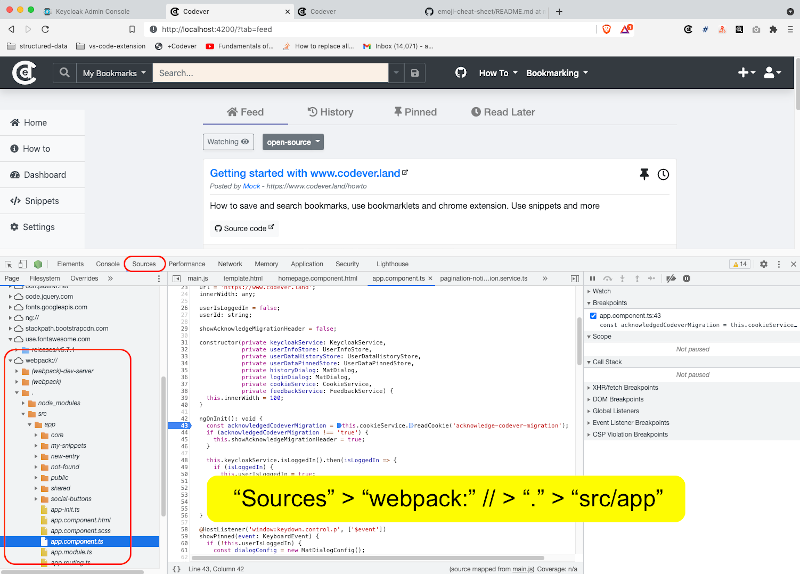
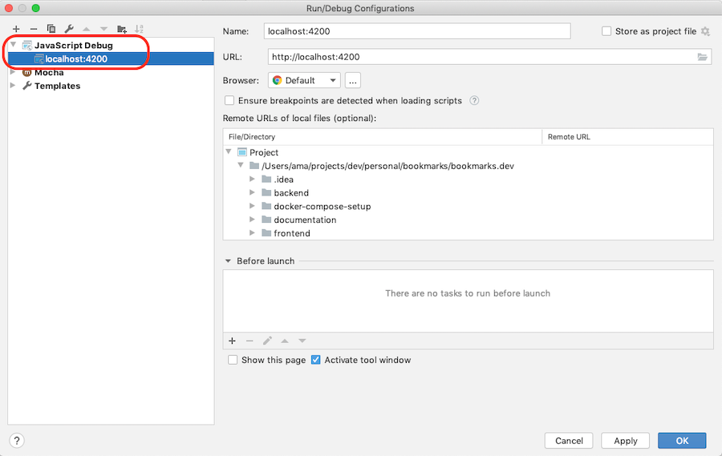
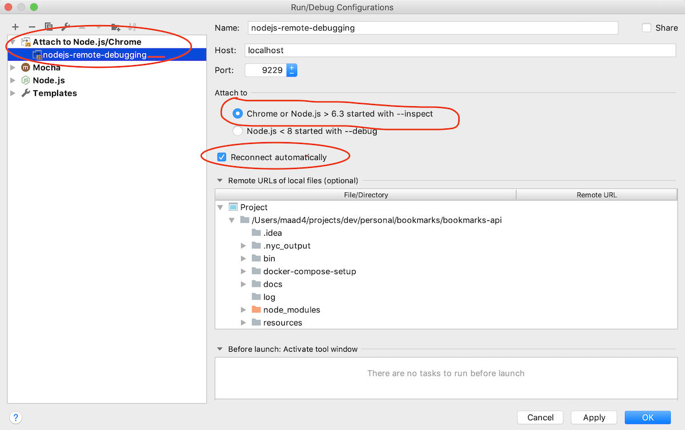

<div align="center">
	
</div>

<div align="center" style="font-size: large">
    <h2> ⚡🔖️ Bookmarks and snippets manager for developers & co 🔖⚡️ </h2>
</div>

<br />

:point_right: Use our [**HowTo pages**](https://www.codever.land/howto)
 to get you going and [start saving time and nerves](https://dev.to/ama/how-i-manage-my-dev-bookmarks-and-save-time-and-nerves-56ae) when managing
your bookmarks and code snippets. The following helpers and extensions will assist you along the way:

## Extensions

| [](https://www.codever.land/howto/bookmarklets) | [](https://chrome.google.com/webstore/detail/codever/diofdblfhjbpgackifolmboaiccmebjb) | [](https://addons.mozilla.org/addon/codever/) | [](https://plugins.jetbrains.com/plugin/14456-codever-snippets/) |
|:---:|:---:|:---:|:---:|
| [Bookmarklet](https://www.codever.land/howto/bookmarklets) |  [Extension](https://chrome.google.com/webstore/detail/codever/diofdblfhjbpgackifolmboaiccmebjb) |  [Addon](https://addons.mozilla.org/addon/codever/) | [Plugin](https://plugins.jetbrains.com/plugin/14456-codever-snippets/) |

### Chrome extension usage example - save snippet
 
 
 
> The other extensions function more or less after the same principle


## Public bookmarks

*******************************************************************************************************************************
Worthy public bookmarks are published regularly on Github at [codeverland/bookmarks](https://github.com/codeverland/bookmarks).
*******************************************************************************************************************************

## Setup (development or self hosting)

These instructions will get you a copy of the project up and running on your local machine for development and testing purposes.

The project is developed with the MEAN stack and [Keycloak](http://www.keycloak.org/) for authentication and authorization:


The project contains two parts

* [frontend](frontend) which makes up the User Interface. This uses with Angular and Angular CLI.
* [backend](backend) which is the API supporting the UI. It uses ExpressJS with MongoDB and Keycloak. See the [OpenAPI specification](https://www.codever.land/api/docs)

### Prerequisites

What you need to run this app:

* `node` and `npm` (we recommend using [NVM](https://github.com/creationix/nvm))
  * Ensure you're running Node at least (`v10.x.x`+) and NPM (`6.x.x`+)
* [nodemon](https://nodemon.io/) - `npm install -g nodemon`
* **Docker** - we recommend using [Docker Desktop](https://www.docker.com/products/docker-desktop)

> Docker and Docker-compose are currently used only for local development

### Installing (**development setup**)

#### Start MongoDB and Keycloak server

:warning: &nbsp; When you run `docker compose` for the **first time** uncomment the following `-Dkeycloak.migration.action=import` line :

```yaml
    #command: -Dkeycloak.migration.action=import -Dkeycloak.migration.provider=dir -Dkeycloak.migration.dir=/tmp/keycloak/export-import -Dkeycloak.migration.strategy=IGNORE_EXISTING
```

in the [docker-compose](docker-compose.yml) file, **so that the initial Keycloak setup (realm and users) is loaded**.

> :warning: &nbsp; For further startups of docker-compose you should **comment back this line**, as it starts faster


```bash
docker-compose up
```

> Use `-d` to run it in the background

#### Install and run (frontend & backend)

You want to have the backend API running first with the following commands:

```shell
# install
nvm use   #only if you are using nvm
npm install

# run
npm run frontend #to run the frontend
npm run backend #to run the backend

#alternatively run in parallel
npm start
```

or in one line `nvm use; npm install; npm start`

This starts

* the API with [nodemon](http://nodemon.io) at [http://localhost:3000/api](http://localhost:3000/api)
 and will watch for code changes in backend and automatically redeploy.
* the frontend available at [http://localhost:4200](http://localhost:4200). Login the user/password **`mock/mock`** configured
  for you in the initial Keycloak setup. Some bookmarks are initially loaded with your account, so you can start playing with them.

> You can create your own test user, or any other extra users by following the screenshots in
> [Add a Keycloak user](documentation/keycloak/add-keycloak-user.md) to create it.

> To be able to automatically add youtube videos published date and duration to the title you need to
create a _nodemon.json_ file based on the [backend/nodemon.json.example](backend/nodemon.json.example) and your own youtube api key

## Testing

### Backend

### Integration tests

> Keycloak and mongodb have to be started as specified above (`docker-compose up` command)

Run the integration test by issuing the following command.

```bash
cd backend;
npm run integration-tests
```

A report will be generated.

## Debugging

### Frontend

#### Dev Tools in Chromium browsers

You can use the Dev Tools in Chromium based browsers (e.g. Chrome, Brave). Navigate to **Sources** and the file you want to set your break points, like in the following example:



#### IntelliJ

In IntelliJ you add Javascript Debug configuration as shown below:



### Backend

#### IntelliJ / Webstorm (Node.js plugin is required)

The `npm run debug` starts nodemon with the `--inspect` parameter so you can attach to this process, by using the following configuration:


#### Visual Studio Code

See [Node.js debugging in VS Code with Nodemon](https://github.com/microsoft/vscode-recipes/tree/master/nodemon)

## Contributing

Please read [CONTRIBUTING.md](CONTRIBUTING.md) for details on our code of conduct, and the process for submitting pull requests to us.

## Versioning

We use [SemVer](http://semver.org/) for versioning. For the versions available, see the [tags on this repository](https://github.com/codeverland/codever/tags).

## Changelog

The changelog is available in [CHANGELOG.md](CHANGELOG.md)

To update the changelog execute the following commands:

```shell
nvm use
standard-changelog
```

## License

This project is licensed under the MIT License - see the [LICENSE](LICENSE) file for details
