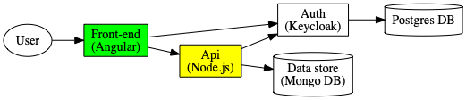

# Bookmarks Manager for Developers & Co
Bookmarks.dev is a bookmark manager created and designed primarily for Developers & Co. It helps you [save time and nerves
when managing your dev bookmarks](https://dev.to/ama/how-i-manage-my-dev-bookmarks-and-save-time-and-nerves-56ae) and eases
[bookmarking of code snippets via Codelets](https://dev.to/ama/bookmarking-code-snippets-with-codelets-3d44). Check our
[HowTo](https://www.bookmarks.dev/howto) page to help you get started. 
 
Most worthy public bookmarks are published regularly on Github in a [separate repository](https://github.com/CodepediaOrg/bookmarks).

## Getting started
These instructions will get you a copy of the project up and running on your local machine for development and testing purposes.

The project is developed with the MEAN stack and [Keycloak](http://www.keycloak.org/) for authentication and authorization:


The project contains two parts
* [frontend](frontend) which makes up the User Interface. This uses with Angular and Angular CLI.
* [backend](backend) which is the API supporting the UI. This uses ExpressJS with MongoDB and Keycloak.

### Prerequisites

What you need to run this app:
* `node` and `npm` (we recommend using [NVM](https://github.com/creationix/nvm))
  * Ensure you're running Node at least (`v6.x.x`+) and NPM (`3.x.x`+)
* [nodemon](https://nodemon.io/) - `npm install -g nodemon`
* **Docker** - we recommend using [Docker Desktop](https://www.docker.com/products/docker-desktop)

> Docker and Docker-compose are currently used only for local development

### Installing (development setup)

#### Start MongoDB and Keycloak server
For the first time uncomment the following line:
```yaml
    #command: -Dkeycloak.migration.action=import -Dkeycloak.migration.provider=dir -Dkeycloak.migration.dir=/tmp/keycloak/export-import -Dkeycloak.migration.strategy=IGNORE_EXISTING
```
in the [docker-compose](docker-compose.yml) file, so that the initial Keycloak setup (realm and users) is loaded.

> By the next docker-compose startups you should comment back this line, as it starts faster

```bash
docker-compose up
```
> Use `-d` to run it in the background

#### Install and run backend
You want to have the backend API running first with the following commands:

```shell
# install
cd backend
nvm use
npm install

# run
npm run debug
```
or in one line `cd backend; nvm use; npm install; npm run debug`

This will start the API with [nodemon](http://nodemon.io) at [http://localhost:3000/api](http://localhost:3000/api)
 and will watch for code changes in backend and automatically redeploy.

> To be able to automatically add youtube videos published date and duration to the title you need to
create a _nodemon.json_ file based on the [backend/nodemon.json.example](backend/nodemon.json.example) and your own youtube api key

#### Install and run frontend
```shell
# install
cd frontend
nvm use
npm install

# run
ng serve
```
or in one line `cd frontend; nvm use; npm install; ng serve`

You can now access the application at [http://localhost:4200](http://localhost:4200) and login 
with the user/password `mock/mock` configured for you in the initial Keycloak setup. Some bookmarks are initially
loaded with your account and you can start playing with them. 

> You can create your own test user, or any other extra users by following the screenshots in
> [Add a Keycloak user](documentation/keycloak/add-keycloak-user.md) to create it.

## Contributing
Please read [CONTRIBUTING.md](CONTRIBUTING.md) for details on our code of conduct, and the process for submitting pull requests to us.

## Versioning

We use [SemVer](http://semver.org/) for versioning. For the versions available, see the [tags on this repository](https://github.com/CodepediaOrg/bookmarks.dev/tags).

## License
This project is licensed under the MIT License - see the [LICENSE](LICENSE) file for details