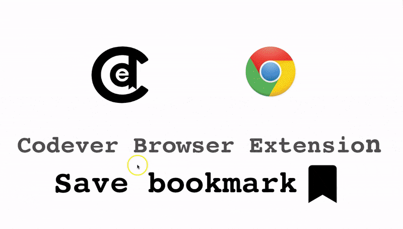
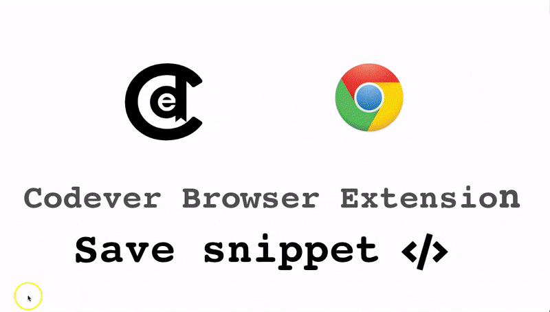
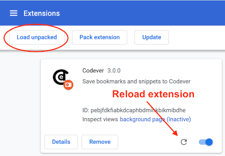

Codever Browser Extension
---
Browser extension to easily save bookmarks and notes from the web to [www.codever.dev](https://www.codever.dev),
the Bookmarks & Notes Manager for Developers — with Markdown and Code Snippets support

The extension source is maintained in the [Codever monorepo](https://github.com/CodeverDotDev/codever/tree/master/apps/codever-browser-extension), under `apps/codever-browser-extension`. It has its own browser-extension build and publishing workflow and does not need to be built together with the Angular application.
 
## Install
This browser extension is available for:

| [](https://chrome.google.com/webstore/detail/codever/diofdblfhjbpgackifolmboaiccmebjb) | [](https://addons.mozilla.org/addon/codever/) |
|:---:|:---:|
| [Chrome](https://chrome.google.com/webstore/detail/codever/diofdblfhjbpgackifolmboaiccmebjb) | [Firefox](https://addons.mozilla.org/addon/codever/) |

> If you can't use Browser Extensions, or you have a tight security blocking pop-up windows from extensions 
> (**Firefox blocks new windows from pages by default**) you can use [our bookmarklet](https://www.codever.dev/howto/bookmarklet)
> which offer the same functionality 

## How to use  

**Right click** OR **click the extension icon** to save as bookmark or note to [Codever](https://www.codever.dev)
- if you make a selection on the web page you will be asked to save as new **bookmark** or **note**
- when bookmarking youtube videos and stackoverflow questions the **tags** are auto-completed

### Save bookmark



### Save snippet




## Testing locally

From an existing Codever monorepo checkout, change to the extension directory:

```bash
cd apps/codever-browser-extension
```

If you only need the extension source, clone the [Codever repository](https://github.com/CodeverDotDev/codever) and use the `apps/codever-browser-extension` directory.

## Chrome/Brave
Go to [chrome://extensions/](chrome://extensions/), click **Load unpacked** and select the `codever-browser-extension`
directory inside the Codever monorepo (`apps/codever-browser-extension`):



> Click "Reload" on the extension when you do modifications 

### Firefox

#### Use [web-ext](https://github.com/mozilla/web-ext)
The easiest way is to use [web-ext](https://github.com/mozilla/web-ext)
 You can install it globally for example via

```
npm install --global web-ext
```

and then run the following command in the root directory of the project

```
web-ext run
```

This installs **Codever** as a temporary add-on, and it watches for changes in the source code
and **redeploys automatically**.

#### Manual deployment

Go to [about:debugging#/runtime/this-firefox](about:debugging#/runtime/this-firefox), click **Load Temporary Add-on...**
 and select `apps/codever-browser-extension/manifest.json` from the Codever monorepo:


### Test the extension against the [`localhost`](https://github.com/CodeverDotDev/codever) version of Codever

Change the following line in [launch-codever-dialog.js](launch-codever-dialog.js):
```
open('https://www.codever.dev/new-entry?url=' + encodeURIComponent(l) + '&selection=' + encodeURIComponent(d) + '&title=' + encodeURIComponent(t) + '&popup=true&initiator=browser-extension', 'Codever', features);
```
to
```
open('http://localhost:4200/new-entry?url=' + encodeURIComponent(l) + '&selection=' + encodeURIComponent(d) + '&title=' + encodeURIComponent(t) + '&popup=true&initiator=browser-extension', 'Codever', features);
```

and Reload the extension 

## Publish the browser extension to official stores

The Chrome and Firefox packages are created from the same Manifest V3 source, but each store has its own developer dashboard, listing metadata, review process, and release workflow. Publish a new version only after testing the exact package that will be uploaded.

### Release checklist

Before creating a package:

1. Update the `version` in [`manifest.json`](manifest.json). The version must be higher than the version already published in the target store and must contain one to four numeric components, for example `4.0.2`.
2. Update [`CHANGELOG.md`](CHANGELOG.md) with the user-visible changes.
3. Test the extension with **Load unpacked** in Chrome or with `web-ext run` in Firefox.
4. Test both entry points:
   - Click the extension icon to save the current page as a bookmark.
   - Select text or use the context menu and verify the Bookmark and Note flows.
5. Check the extension error panel in the browser and confirm that the production URL is used instead of `localhost`.
6. Commit the source and manifest changes before uploading the package.

### Create the release package

Run the packaging commands from this directory:

```bash
cd apps/codever-browser-extension
```

#### Using `web-ext`

Install `web-ext` once if it is not already available:

```bash
npm install --global web-ext
```

Build a ZIP while excluding development documentation, screenshots, and previous artifacts:

```bash
web-ext build --overwrite-dest \
  -i resources \
  -i assets \
  -i README.md \
  -i CHANGELOG.md \
  -i web-ext-artifacts
```

The generated package is placed in `web-ext-artifacts/`.

#### Using the standard `zip` command

The following command creates a package in which `manifest.json` is at the ZIP root, as required by the stores:

```bash
VERSION=4.0.1
mkdir -p web-ext-artifacts
zip -r "web-ext-artifacts/codever-browser-extension-${VERSION}.zip" . \
  -x 'resources/*' \
	 'assets/*' \
	 'README.md' \
	 'CHANGELOG.md' \
	 'web-ext-artifacts/*' \
	 '*.idea*' \
	 '*.git*'
```

Verify the archive before uploading it:

```bash
unzip -l "web-ext-artifacts/codever-browser-extension-${VERSION}.zip"
```

The listing should contain these entries at the top level:

```text
manifest.json
background.js
launch-codever-dialog.js
icons/
```

Do not upload a ZIP that contains an extra outer directory such as `codever-browser-extension/manifest.json`.

### Publish to the Chrome Web Store

1. Open the [Chrome Web Store Developer Dashboard](https://chrome.google.com/webstore/devconsole).
2. Register as a Chrome Web Store developer if this is the first publication. Google may require account verification and a developer registration payment.
3. For a new listing, choose **Add new item**. For an existing listing, open the existing Codever item and upload a new package.
4. Upload the release ZIP from `web-ext-artifacts/`.
5. Complete or review the store listing:
   - Name: `Codever`
   - Short and detailed descriptions
   - Category and language
   - Screenshots and promotional images
   - Support and homepage URLs
6. Complete the privacy and permissions declarations accurately.
7. Save the draft, resolve validation errors, and select **Submit for review**.

The extension currently requests `activeTab`, `contextMenus`, and `scripting`:

- `activeTab` allows access to the active page after the user invokes the extension.
- `contextMenus` provides the right-click **Save to Codever** action.
- `scripting` injects the small script that reads the page URL, title, and optional selected text.

The extension sends the page URL, title, and selected text to Codever only after the user invokes it. Make sure the store privacy declarations and the [Codever privacy policy](https://www.codever.dev/privacy-policy) accurately describe this behavior before submitting.

Chrome expects `manifest.json` at the root of the uploaded ZIP. The package must also use a version that has not previously been uploaded to the listing.

### Publish to Firefox Add-ons

1. Create and verify the release ZIP using the packaging instructions above.
2. Open the [Firefox Add-ons Developer Hub](https://addons.mozilla.org/en-US/developers/).
3. Choose **Submit a New Add-on** for a new listing, or open the existing Codever add-on to submit an update.
4. Upload the ZIP and select the distribution channels requested by Mozilla.
5. Complete the listing details, screenshots, support information, and privacy disclosures.
6. If Mozilla requests source code for review, provide the corresponding source for the exact submitted version.
7. Submit the add-on for review and monitor the developer dashboard for review messages.

For local Firefox testing, `web-ext sign` can also be used when you need a signed package for testing or distribution. Store signing and approval are handled through the Mozilla developer dashboard.

### After publication

After a store accepts the release:

1. Verify the installed store version in a clean browser profile.
2. Test the icon and context-menu actions in both Chrome and Firefox.
3. Confirm that login, bookmark creation, note creation, and selected-text handling work against production.
4. Tag the source release in the monorepo, for example:

   ```bash
   git tag browser-extension-v4.0.2
   git push origin browser-extension-v4.0.2
   ```

5. Keep the manifest version, changelog, store version, and release tag aligned.
