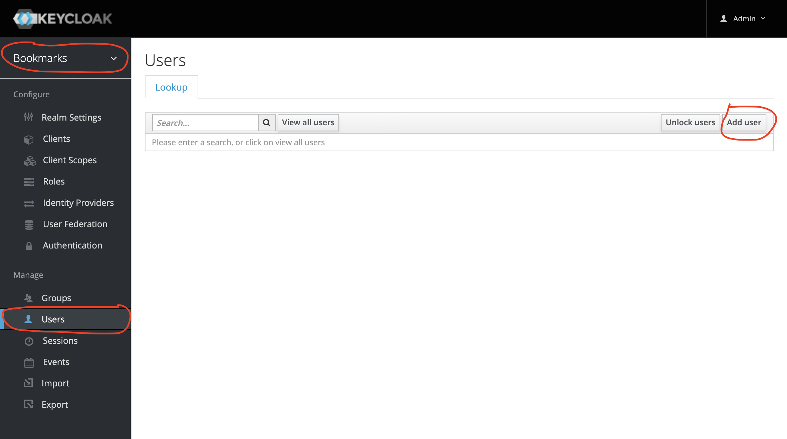
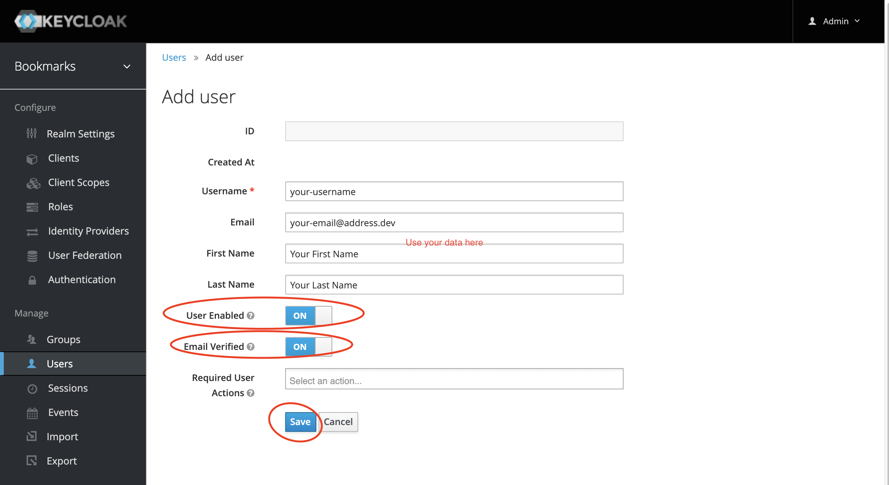
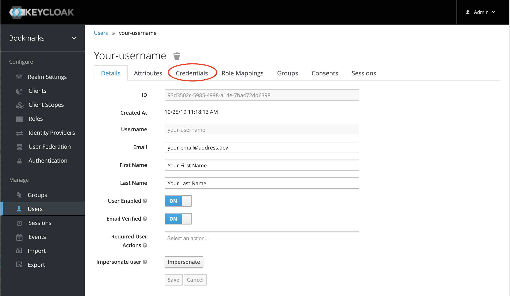
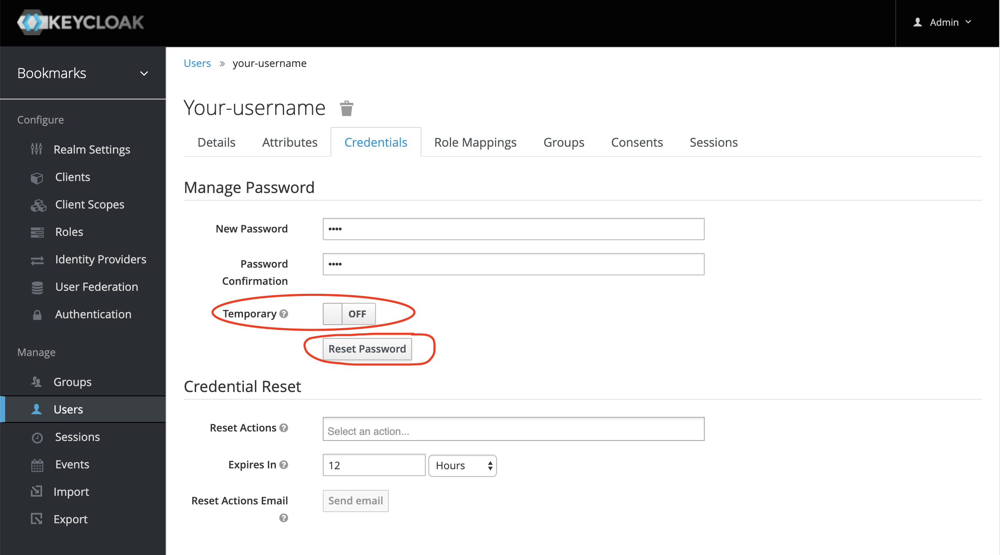

## How to add a Keycloak User

### Log in the Keycloak Admin Console

This is accessible at [http://localhost:8480/auth/admin](http://localhost:8480/auth/admin)
Change to the **bookmarks** or directly via link [bookmarks-keycloak-realm](http://localhost:8480/auth/admin/master/console/#/realms/bookmarks) 

_Username_ and _password_ are - `admin` and `Pa55w0rd` as specified in **docker-compose.yml**

### Create User

#### Go to the users section

 
 
#### Set user details

> Make usre you set the **User enabled** and **Email verified** flags

Click **Save**

#### Set user credentials

After saving you will be taken to the User Details screen:

Navigate from there to the **Credentials** tab:

Set and confirm your password.

> Make sure the "Temporary" flag is **OFF**

## That's it!

Go on and login with the **username** or **email** you set up for the user and add your first test bookmark.

